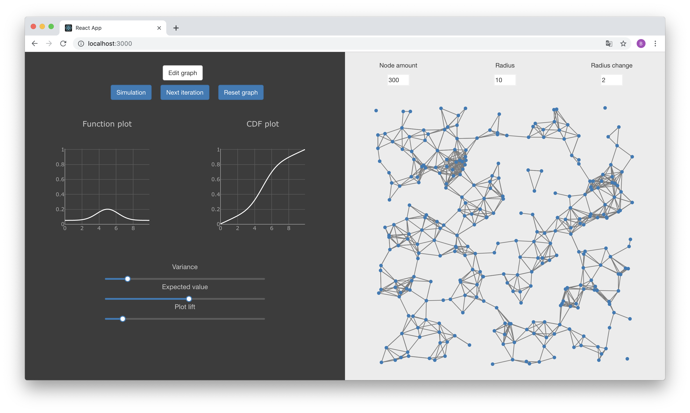
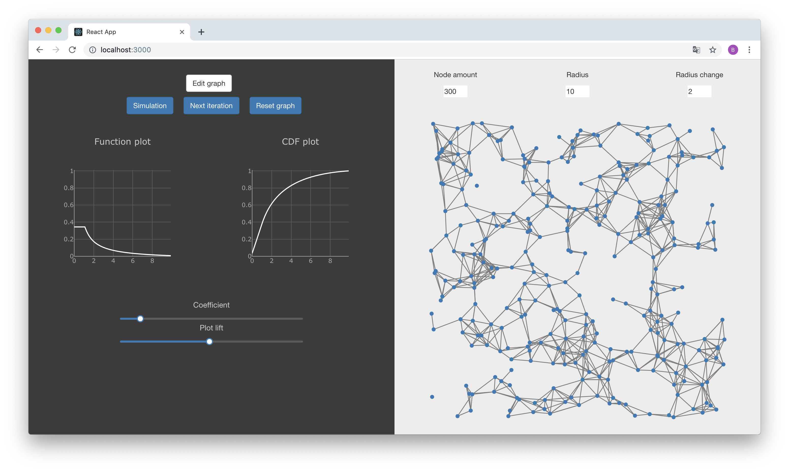

# Social Network Dynamics
ReactJS app for simulating social network dynamics. It uses Random Geometric Graph model to generate links between nodes basing on distribution of probability of node attractiveness (from 0 to 10).

Used probability functions:
- Gaussian
- Linear
- Staircase
- Rational

Frameworks and Libraries used:
- ReactJS
- Bootstrap
- Plotly
- D3.js

##### To run:
>1. Installing depedencies: `npm install`
>2. Running app server: `npm start` (localhost:3000 by default)

##### Sample screenshots:

